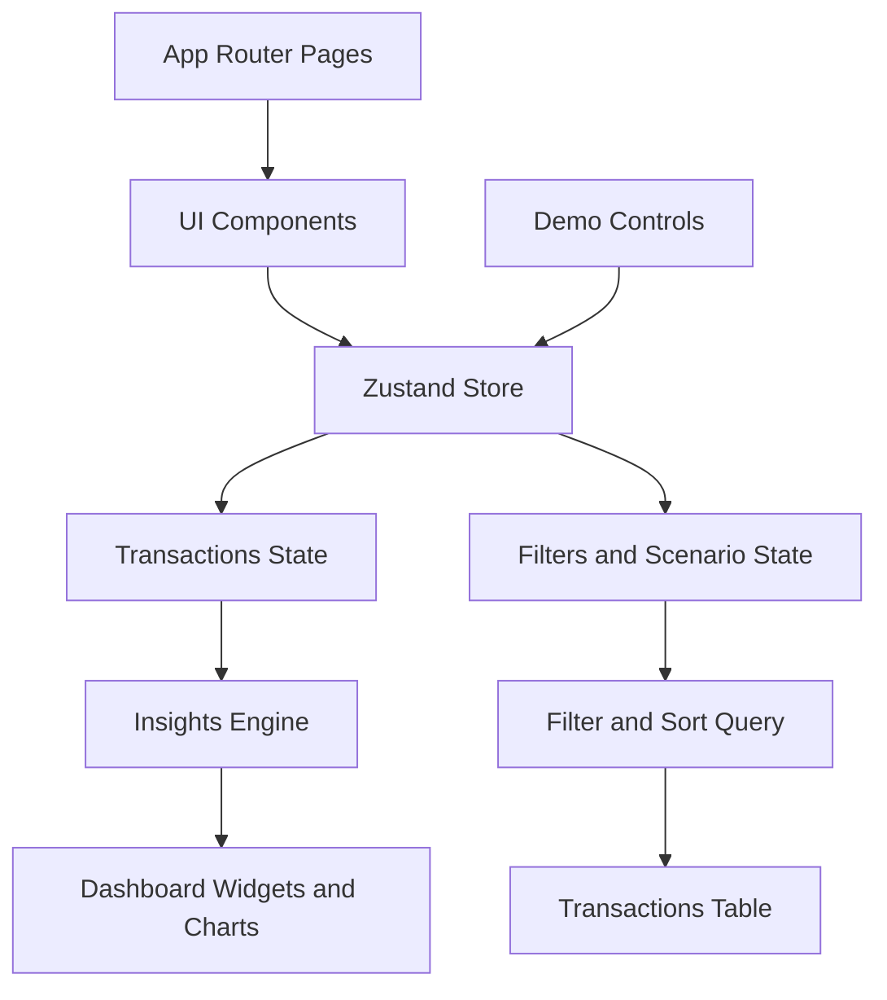

# Finboard

Finboard is a role-based personal finance dashboard built with Next.js App Router, Zustand, Tailwind CSS, shadcn/ui, and Recharts. It is optimized for interview/demo walkthroughs with strong data storytelling, transaction power tools, and scenario-driven testing.

## Links

- Live Demo: https://finboard-tracker.vercel.app/
- Repository: https://github.com/ornobaadi/FinBoard

## Product Screenshots

### Dashboard Preview


### Transactions Preview


## Core Features

### Dashboard

- Summary cards: income, expenses, net balance, transaction count
- Data storytelling layer:
	- top 3 category concentration
	- burn-rate projection
	- budget health status (`Safe`, `Watch`, `Risk`)
	- anomaly marker for unusually large expenses
	- narrative insights for trend and category changes
- Visualizations:
	- monthly trend chart
	- spending breakdown chart with custom tooltip (value, share, month context)

### Transactions Workspace

- Search and filtering:
	- search by description
	- type/category/status filters
	- date range filters
	- quick views (`This Month`, `Pending`, `High Expense`)
- Sorting and table productivity:
	- sortable columns (`Date`, `Amount`, `Status`) with asc/desc indicators
	- quick sort presets (`Newest`, `Oldest`, `Highest Amount`, `Lowest Amount`)
	- paginated transaction table
- Admin controls:
	- add, edit, delete transactions
	- delete undo toast (5-second rollback)
	- CSV export for current filtered dataset

### Demo and Delivery Layer

- Seeded scenarios:
	- `Balanced`
	- `Overspending`
	- `High Savings`
- One-click reset to original seed data
- Scenario switch and reset controls on both dashboard and transactions pages

## Performance and Accessibility Hardening

- Memoized derived selectors for dashboard and transaction filtering
- Lazy-loaded lower-priority dashboard widgets
- Route-level loading skeletons for `app/` and `app/transactions/`
- Focus-visible treatment and icon button labels
- Reduced-motion support for animated number transitions
- Intentional empty states for charts

## Testing and Quality Gates

### Covered tests

- `lib/insights.test.ts`: insights calculations and anomaly behavior
- `lib/transactions-query.test.ts`: filter and sort logic
- `store/useAppStore.test.ts`: CRUD and scenario/reset actions

### CI-ready checks

- `npm run lint`
- `npm run typecheck`
- `npm run test`
- `npm run ci:check` (runs all checks)

## Architecture



## Tech Stack

- Next.js 16 (App Router)
- TypeScript
- Tailwind CSS
- shadcn/ui (Base UI primitives)
- Zustand (with persist)
- Recharts
- Vitest + Testing Library

## Getting Started

```bash
npm install
npm run dev
```

Open `http://localhost:3000`.

## Scripts

- `npm run dev` - Start development server
- `npm run build` - Create production build
- `npm run start` - Run production server
- `npm run lint` - Run ESLint
- `npm run typecheck` - Run TypeScript checks
- `npm run test` - Run unit tests once
- `npm run test:watch` - Run tests in watch mode
- `npm run ci:check` - Run lint, typecheck, and tests

## Project Structure

- `app/` - Routes, loading skeletons, metadata
- `components/` - Layout, dashboard, transactions, ui primitives
- `store/` - Zustand store, selectors, actions
- `data/` - Seed transactions and demo scenarios
- `lib/` - Insights and filtering/sorting utilities
- `types/` - Shared TypeScript types
- `public/screenshots/` - Demo preview assets

## Assumptions

- Data is local and persisted in browser storage.
- Role toggle is for demonstration; real authentication is out of scope.
- Currency format is BDT.
- Charts and summaries are computed client-side from local state.

## Known Limitations

- No backend sync or multi-device persistence.
- Scenario switching resets custom in-session edits by design.
- Accessibility checks are integrated through code quality and component review, but automated Lighthouse CI is not yet wired.

